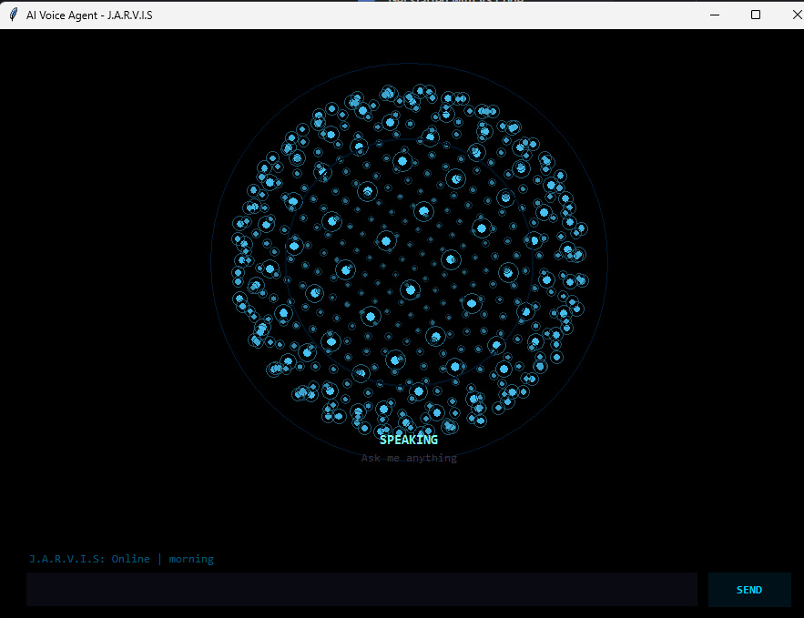

# JARVIS Local Assistant



JARVIS is a local-first desktop assistant inspired by Iron Man's AI. It runs on your computer without requiring cloud APIs or external AI model keys. The project uses local command parsing, voice recognition, desktop automation, and optional text-to-speech for a more interactive, movie-style experience — now with a cinematic animated HUD and a wider set of built-in skills.

## Project Idea

The goal of this project is to create a lightweight JARVIS-style assistant that can:
- listen for voice commands,
- execute desktop actions,
- open apps and web pages,
- control media playback,
- send messages,
- check the weather, do quick math, take notes, and set reminders,
- respond with voice or text,
- and remember simple preferences.

This is not a full cloud-powered chatbot. Instead, it is a rule-driven local assistant built for easy extension and offline-friendly workflows.

## Supported Platforms

- Windows 10/11
- macOS 12+
- Linux (any distro with a desktop session, e.g. Ubuntu, Fedora, Arch)

## Requirements

- Python 3.10 or newer (tested up to 3.14)
- `Tkinter` for the desktop UI
- `SpeechRecognition` for voice input (uses `sounddevice` for microphone capture by default — no `PyAudio` needed)
- `pyttsx3` for optional local text-to-speech
- `psutil` for live CPU / RAM / battery readouts in the HUD

All Python dependencies are listed in `requirements.txt`, including platform-specific markers so a single `pip install -r requirements.txt` works correctly on Windows, macOS, and Linux — **without needing to compile anything**.

> **Note on PyAudio:** `requirements.txt` intentionally does *not* install `PyAudio`. It is a native extension that often fails to build on Windows (missing `portaudio.h` / Visual C++ headers) and on very new Python versions like 3.14 that don't have prebuilt wheels yet. JARVIS doesn't need it: `SpeechRecognition` automatically records through `sounddevice` (already included) when `PyAudio` isn't present. If you want to install `PyAudio` anyway, see the bottom of `requirements.txt` for OS-specific instructions.

## Installation

1. Install Python 3.10+ from [python.org](https://www.python.org/downloads/) (make sure to check "Add to PATH" on Windows).

2. **Linux only** — install the system package needed by Tkinter first (audio works out of the box via `sounddevice`, no extra system packages required):
```bash
# Debian/Ubuntu
sudo apt-get update
sudo apt-get install -y python3-tk

# Fedora
sudo dnf install -y python3-tkinter

# Arch
sudo pacman -S tk
```

3. Create and activate a virtual environment.

Windows:
```bash
python -m venv .venv
.\.venv\Scripts\activate
pip install -r requirements.txt
```

macOS / Linux:
```bash
python3 -m venv .venv
source .venv/bin/activate
pip install -r requirements.txt
```

4. Run the application:
```bash
python main.py
```

## Features

### Cinematic animated HUD
- Boot-up sequence with a typed status log, just like an AI core coming online.
- Circular arc-reactor style HUD with layered glow rings, a rotating radar sweep, drifting particles, and a live voice waveform while JARVIS speaks.
- Corner brackets and a sci-fi grid background for a true movie-console feel.
- Live top-left SYSTEM panel (CPU / RAM / battery bars) and top-right TIME panel (clock + date), refreshed every second.
- Color-coded state ring: cyan idle, green listening, amber thinking, cyan-white executing, pink speaking, red error.
- Clean, unobstructed HUD — the on-screen response log panel has been removed so the arc-reactor logo is always fully visible; the conversation is still echoed to the console with timestamps for debugging.
- One-click MIC and VOICE toggle buttons in the command bar.

### Core assistant
- Automatic voice listening after startup, with manual mic toggle.
- Voice recognition using `SpeechRecognition`; falls back to `sounddevice` when needed.
- Text-to-speech output with `pyttsx3` when available, with a mute toggle.
- Open and close applications by name, cross-platform.
- Play the exact requested song on Spotify — resolved through the real Spotify catalog, then explicitly commanded to start (not just opened) once you approve access once — or the exact top-matching video on YouTube in the default or a named browser.
- Send messages on WhatsApp and other messaging platforms.
- Lock, sleep, or shut down the computer — always with a spoken confirmation step.
- Open the webcam / camera viewer.
- Remember simple free-form preferences ("remember that my favorite color is blue") and recall them later.

### New skills
- **Weather** — "what's the weather" or "weather in Tokyo" (free, keyless Open-Meteo API, IP-based location fallback).
- **Jokes & quotes** — "tell me a joke", "inspire me".
- **Calculator** — "calculate 12 times 8 plus 5", "what is 45 divided by 9" (safe AST-based parser, no `eval`).
- **Notes** — "take a note buy milk", "read my notes", "clear my notes".
- **Reminders & timers** — "remind me in 10 minutes to check the oven", "set a timer for 5 minutes".
- **Screenshots** — "take a screenshot" (saved to `~/Pictures/JARVIS_Screenshots`).
- **Media control** — "play music", "pause music", "next song", "volume up", "mute".
- **Translation** — "translate hello to spanish" (via `deep-translator`).
- **Google search** — "search google for best pizza in Rome".
- **Battery & system status** — "system status", "battery level".
- **Wikipedia & public IP** lookups, as before.

## Accurate Spotify Playback (recommended setup)

By default, "play `<song>` on Spotify" just opens Spotify's search for you to pick manually — that's the only safe fallback when JARVIS has no way to find or start the right track. To let JARVIS find the *exact* track **and actually press play**, set up a free Spotify app once:

1. Create a free app at the [Spotify Developer Dashboard](https://developer.spotify.com/dashboard) (any Spotify account works).
2. In the app's settings, add this exact Redirect URI: `http://127.0.0.1:8888/callback`.
3. Set your credentials using **either** of these (the file is the more reliable option — see the troubleshooting note below):
   - **Recommended — a local file:** copy `jarvis.env.example` to `jarvis.env` (same folder as `main.py`) and fill in the two values:
     ```
     SPOTIFY_CLIENT_ID=your-client-id
     SPOTIFY_CLIENT_SECRET=your-client-secret
     ```
     JARVIS loads this file automatically every time it starts — no terminal setup needed. It's already excluded from git.
   - **Alternative — real environment variables:**
     ```bash
     export SPOTIFY_CLIENT_ID="your-client-id"
     export SPOTIFY_CLIENT_SECRET="your-client-secret"
     ```
     On Windows: `set VAR=value` (Command Prompt) or `$env:VAR="value"` (PowerShell). These must be set **in the exact same terminal window/session** you use to run `python main.py`.
4. The **first** time you ask JARVIS to play something on Spotify, it opens a browser tab asking you to approve access (needs Spotify Premium to control playback). Approve it once — JARVIS caches the login locally (`memory/spotify_token.json`, already excluded from git) and silently refreshes it after that, so you won't be asked again.

**Why this step matters:** searching Spotify's catalog and *commanding playback* are two different permissions. A search-only token can find the exact song but can only *ask* the Spotify app to open it — Spotify itself then decides whether to autoplay, which is why a correct song could still fail to start. The one-time login above gives JARVIS a token that's actually allowed to press play, so it explicitly starts the exact track on your active device (retrying briefly if Spotify was just launched and hasn't registered as a device yet).

Even without that login (or on a Free account, where Spotify's Web API refuses playback commands), JARVIS still opens the exact resolved track and then sends the system play/pause key, which reliably starts it because that key always targets whatever track Spotify just loaded — never a random or wrong result. So "found the song but it isn't playing" should no longer happen either way; the login above is what removes the small delay/best-effort nature of that fallback.

If you skip this setup, JARVIS still finds the exact track once `SPOTIFY_CLIENT_ID`/`SPOTIFY_CLIENT_SECRET` are set, but relies on Spotify's own link-handling to start it — which is best-effort, not guaranteed. Without any credentials at all, JARVIS only opens Spotify's search box.

### "JARVIS still says 'Set SPOTIFY_CLIENT_ID...' even though I set it"

This message means JARVIS could not see the variables in its own process — almost always because of *where* they were set, not a code problem. Common causes:

- You exported the variables in one terminal window, then ran `python main.py` in a **different** terminal, or from an IDE "Run" button / desktop shortcut that doesn't inherit that terminal's session. → Use the `jarvis.env` file instead; it always works regardless of how JARVIS is launched.
- You closed and reopened the terminal after exporting — `export`/`set` only last for that session unless made permanent (e.g. added to `~/.bashrc`, `~/.zshrc`, or Windows' System Environment Variables).
- A typo in the variable name, or the value has stray quotes/spaces.
- To double-check what JARVIS itself sees, run this in the *same* terminal right before `python main.py`:
  ```bash
  python -c "import os; print(os.getenv('SPOTIFY_CLIENT_ID'), os.getenv('SPOTIFY_CLIENT_SECRET'))"
  ```
  If that prints `None None`, the variables truly aren't reaching Python yet — switch to `jarvis.env`.

## Example Commands

- `open spotify`
- `play Shape of You on Spotify`
- `open Despacito on YouTube in Edge`
- `what's the weather in Paris`
- `tell me a joke`
- `calculate 25 percent of 480` *(spoken as `calculate 480 times 0.25`)*
- `take a note call mom tomorrow`
- `remind me in 15 minutes to stretch`
- `take a screenshot`
- `translate good morning to french`
- `search google for best pizza in rome`
- `send message to Minh on WhatsApp`
- `close chrome`
- `system status`
- `what time is it`
- `bye`

## How to Use

- Start the app with `python main.py`.
- Watch the boot sequence, then speak a command or type it into the input box.
- Use the `SEND` button or press `Enter` to submit text.
- Use `MIC: ON/OFF` to pause automatic voice listening, and `VOICE: ON/OFF` to mute spoken replies.
- The assistant speaks its response back if `pyttsx3` is installed and voice output is enabled (also printed to the console).
- Say `bye`, `goodbye`, or `you can sleep` to stop the assistant.

## Notes

- Command understanding is local and rule-based, not powered by a cloud LLM — fast, private, and works offline for most actions.
- Voice recognition can use Google Web Speech without an API key, but it requires internet access. If `pocketsphinx` is installed, offline recognition may be available.
- Weather, translation, Wikipedia, IP lookup, and Google search need an internet connection; everything else works fully offline.
- Spotify playback no longer relies on simulated screen clicks — see "Accurate Spotify Playback" above. `pyautogui` and `pyperclip` are still used for messaging apps and the browser address bar, so keep them installed for best automation coverage.

## Project Structure

- `main.py` — application entry point.
- `jarvis/app.py` — starts the UI.
- `jarvis/ui.py` — the animated Tkinter HUD (boot sequence, HUD rendering, status panels, event loop).
- `jarvis/command_router.py` — local command parsing and feature dispatch.
- `jarvis/speech.py` — voice recognition and text-to-speech.
- `jarvis/automation.py` — Spotify, YouTube, WhatsApp, and browser automation.
- `jarvis/app_launcher.py` — cross-platform app open/close logic.
- `jarvis/power_control.py` — lock / sleep / shutdown.
- `jarvis/camera.py` — webcam viewer.
- `jarvis/system_info.py` — time, date, CPU/RAM/battery status.
- `jarvis/weather.py` — keyless weather lookups.
- `jarvis/calculator.py` — safe arithmetic parsing.
- `jarvis/fun.py` — jokes and quotes.
- `jarvis/screenshot.py` — screen capture.
- `jarvis/media_control.py` — media key control (play/pause/volume/track).
- `jarvis/translator.py` — text translation.
- `jarvis/reminders.py` — background timers/reminders.
- `jarvis/user_memory.py` — local JSON store for preferences, history, and notes.
- `requirements.txt` — Python dependency list with per-OS markers.
